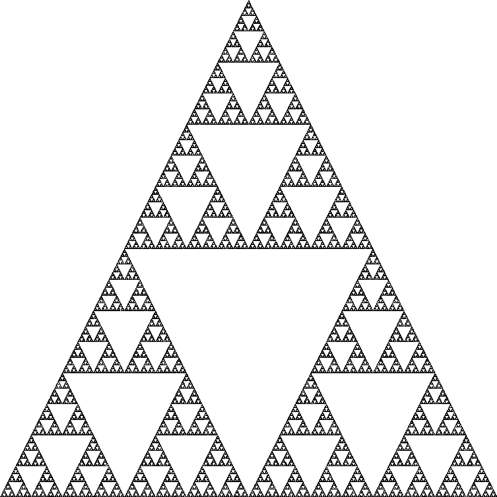
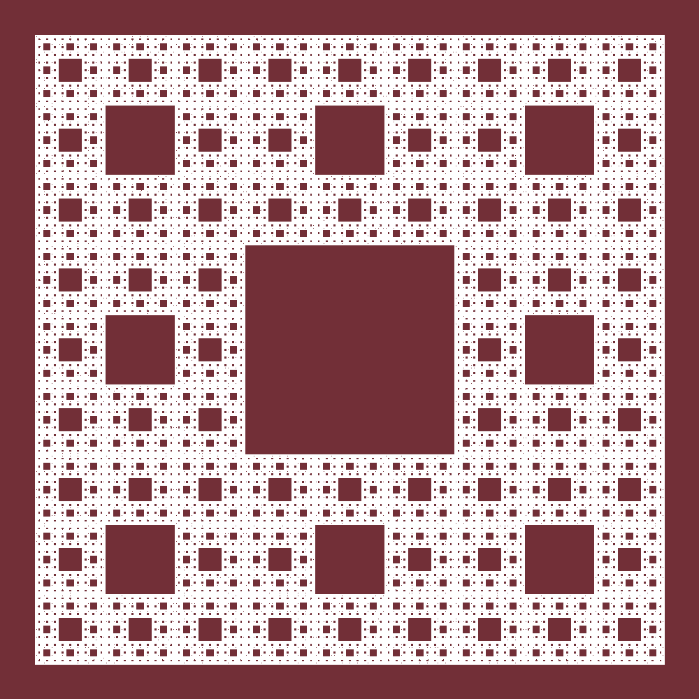
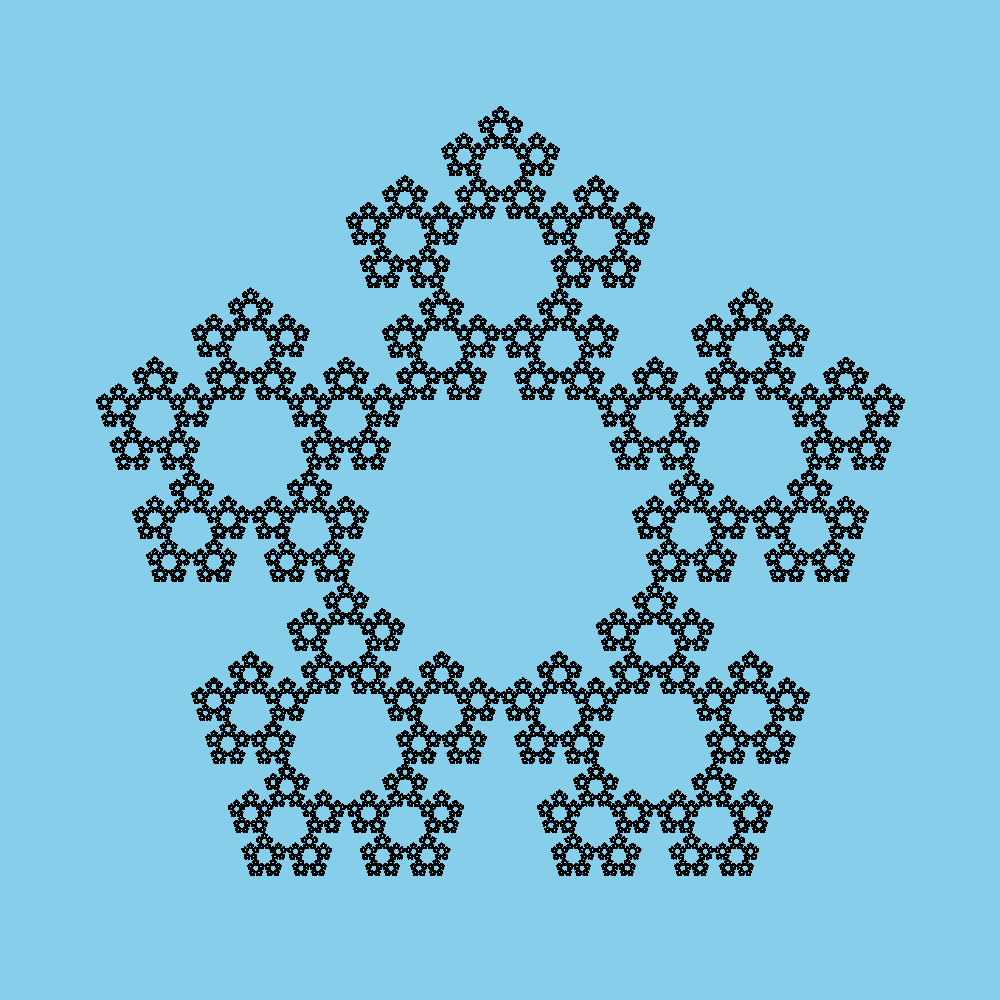
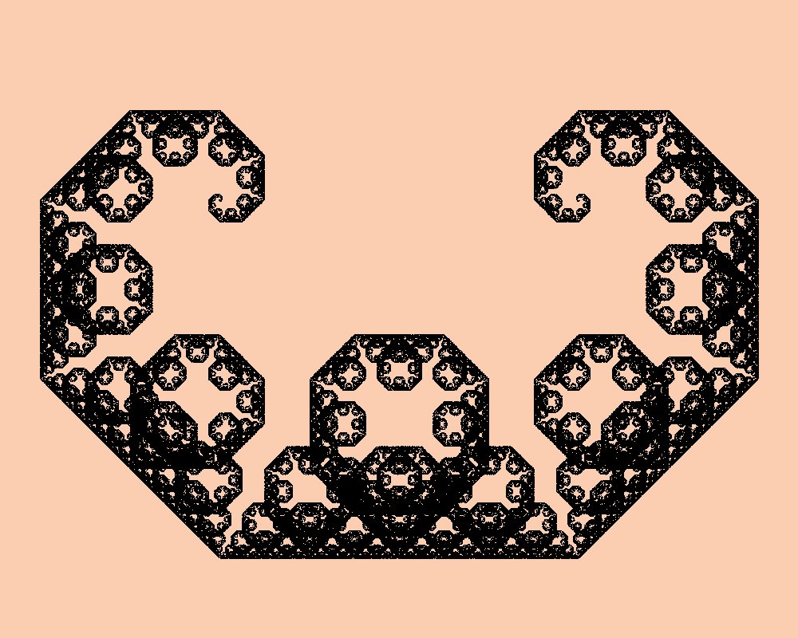
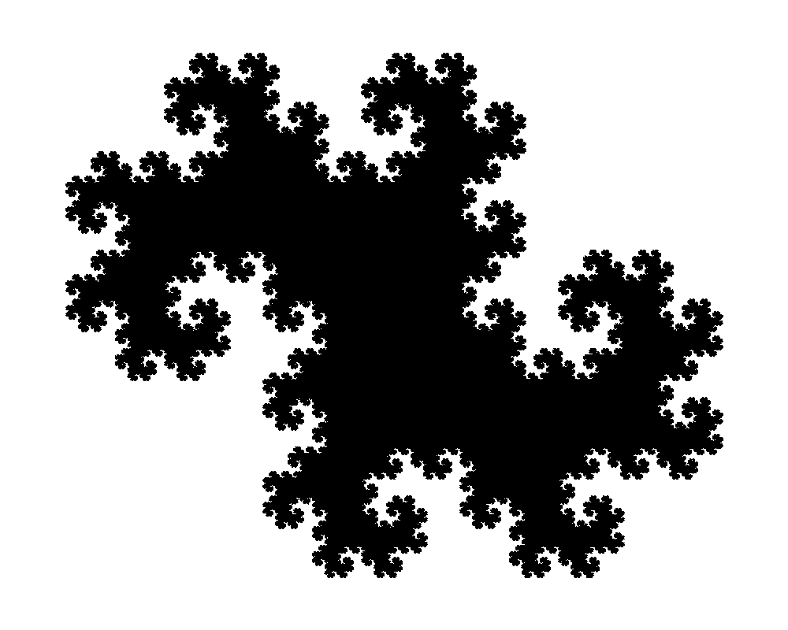
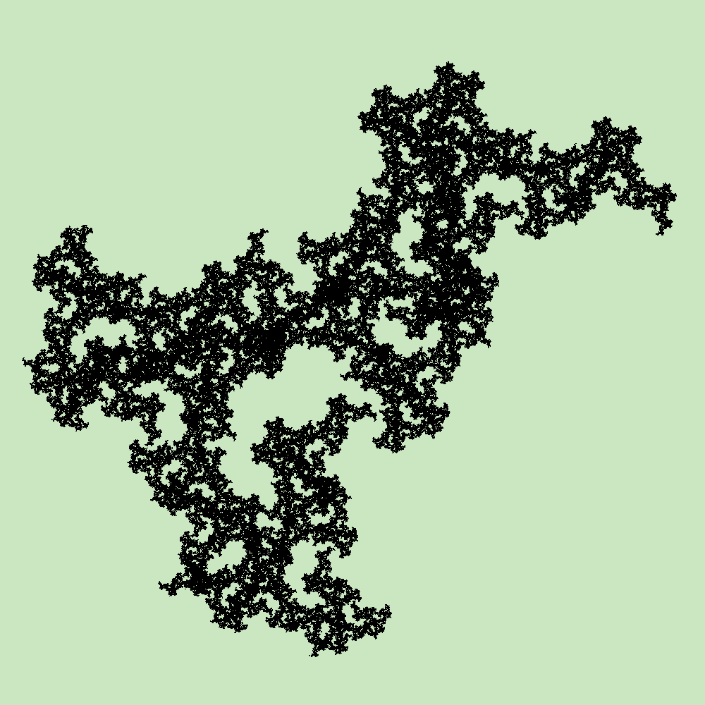
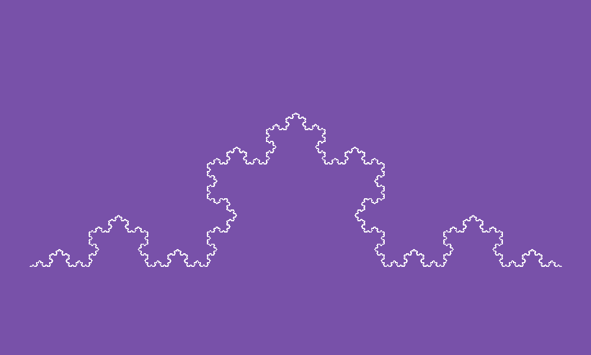
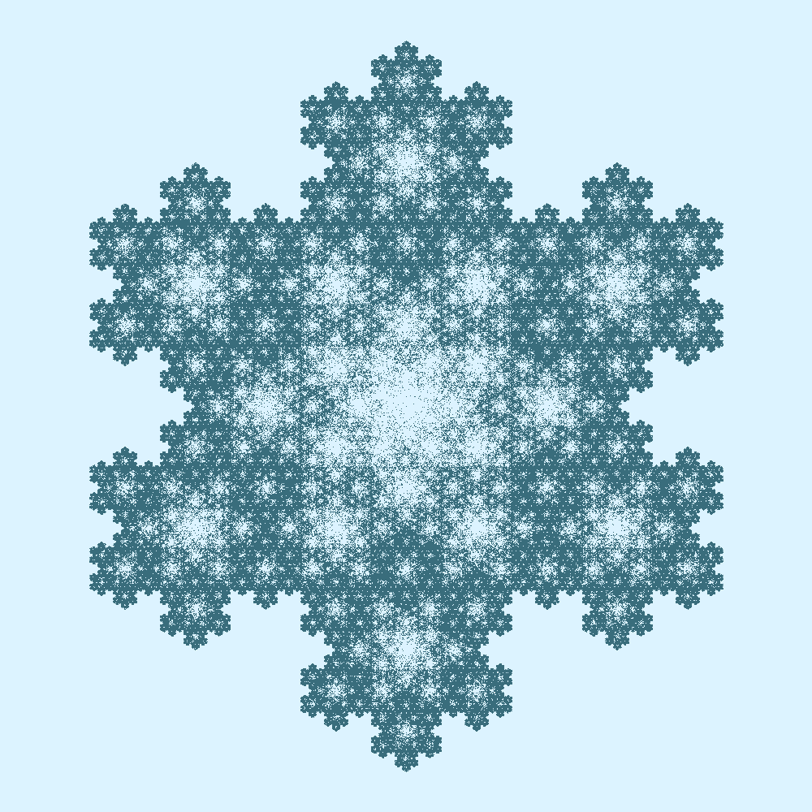
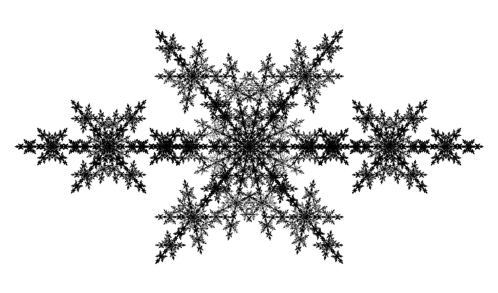
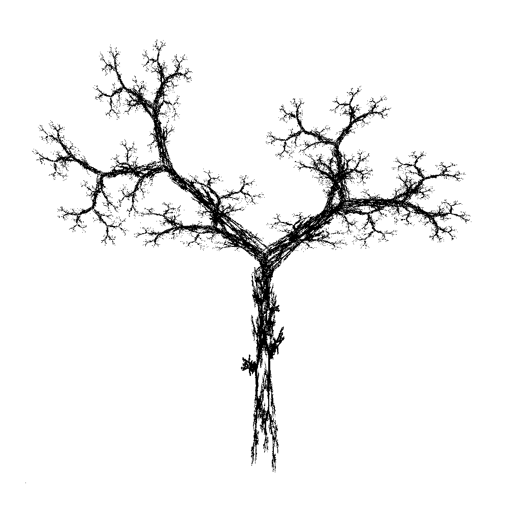

# Fernery 🌿

A CLI tool for generating images of ferns and other [Iterated Function Systems](https://en.wikipedia.org/wiki/Iterated_function_system).


## Getting Started

Install [stack](https://docs.haskellstack.org/en/stable/install_and_upgrade/), then:

```bash
git clone git@github.com:TheTeaCat/fernery.git
cd fernery
stack build
stack exec fernery-exe
```

This should generate an image of a Barnsley fern at [./fern.png](./fern.png) by default, with colours reminiscent of an [Anna Atkins cyanotype](https://www.moma.org/artists/231). 

Various options are available to customise the appearance of the ferns. To see the supported options, do:

```bash
stack exec -- fernery-exe --help
```

### Installing with Homebrew (macOS)

Fernery is also available to install from our Homebrew Tap.

```bash
brew tap two-twelve/tap
brew install fernery
fernery --help
```

## [FractalTees.Shop](https://fractaltees.shop/) 🛍

A selection of images generated using Fernery are available printed on T-shirts and tote bags at [fractaltees.shop](https://fractaltees.shop/).

<p align="center">
  <a href="https://fractaltees.shop/product/barnsley-fern/">
    
  </a>
  <a href="https://fractaltees.shop/product/leptosporangiate/">
    
  </a>
  <a href="https://fractaltees.shop/product/thelypteridaceae-shirt/">
    
  </a>
</p>


## Example Images

This list of examples is currently exhaustive of the IFSs provided in Fernery, but I'd love to see more added to this little CLI tool. PRs are welcome! 🧑‍🎨

- [Barnsley Fern](#Barnsley-Fern)
- [Leptosporangiate Fern](#Leptosporangiate-Fern)
- [Thelypteridaceae Fern](#Thelypteridaceae-Fern)
- [The Sierpinski Gasket](#The-Sierpinski-Gasket)
- [The Sierpinski Carpet](#The-Sierpinski-Carpet)
- [The Sierpinski Pentagon](#The-Sierpinski-Pentagon)
- [The Levy Dragon](#The-Levy-Dragon)
- [The Heighway Dragon](#The-Heighway-Dragon)
- [McWorter's Pentigree](#McWorters-Pentigree)
- [The Koch Curve](#The-Koch-Curve)
- [The Koch Snowflake](#The-Koch-Snowflake)
- [DavidLDewey Fractal](#DavidLDewey-Fractal)
- [Tree Fractal](#Tree-Fractal)


### Barnsley Fern

```bash
stack exec -- fernery-exe -f barnsley
```

<p align="center">
  
</p>


### Leptosporangiate Fern

The transforms used in this fern were found [here](https://en.wikipedia.org/wiki/File:Barnsley_fern_mutated_-Leptosporangiate_fern.PNG).

```bash
stack exec -- fernery-exe -f leptosporangiate -s '(210, -160)'
```

<p align="center">
  
</p>


### Thelypteridaceae Fern

The transforms used in this fern were found [here](https://en.wikipedia.org/wiki/File:Barnsley_fern_with_different_coefficients_plotted_with_VisSim.PNG).

```bash
stack exec -- fernery-exe -f thelypteridaceae -s '(-210, 125)'
```

<p align="center">
  
</p>


### The Sierpinski Gasket

```bash
stack exec -- fernery-exe -f sierpinskiGasket -o '(500,1000)' -s '(500,500)' -c 'PixelRGBA8 0 0 0 255' -b 'PixelRGBA8 255 255 255 255'
```

<p align="center">
  
</p>


### The Sierpinski Carpet

```bash
stack exec -- fernery-exe -f sierpinskiCarpet -o '(50,50)' -s '(900,900)' -i 10000000 -c 'PixelRGBA8 255 255 255 255' -b 'PixelRGBA8 114 47 55 255' 
```

<p align="center">
  
</p>


### The Sierpinski Pentagon

```bash
stack exec -- fernery-exe -f sierpinskiPentagon -o '(250,875)' -s '(500,500)' -b 'PixelRGBA8 135 206 235 255' -c 'PixelRGBA8 0 0 0 255'
```

<p align="center">
  
</p>


### The Levy Dragon

```bash
stack exec -- fernery-exe -f levyDragon -o '(275,250)' -s '(450,450)' -d '(1000,800)' -b 'PixelRGBA8 251 206 177 255' -c 'PixelRGBA8 0 0 0 255'
```

<p align="center">
  
</p>


### The Heighway Dragon

```bash
stack exec -- fernery-exe -f heighwayDragon -o '(250,500)' -d '(1000, 800)' -s '(600,600)' -c 'PixelRGBA8 0 0 0 255' -b 'PixelRGBA8 255 255 255 255' -i 2000000
```

<p align="center">
  
</p>


### McWorter's Pentigree

```bash
stack exec -- fernery-exe -f mcWortersPentigree -o '(130,330)' -s '(800,800)' -b 'PixelRGBA88 202 231 193 255' -c PixelRGBA88 0 0 0 255'
```

<p align="center">
  
</p>


### The Koch Curve

```bash
stack exec -- fernery-exe -f kochCurve -s '(900,-900)' -o '(50,450)' -d '(1000,600)' -b 'PixelRGBA8 120 81 169 255'
```

<p align="center">
  
</p>


### The Koch Snowflake

```bash
stack exec -- fernery-exe -f kochSnowflake -o '(500,500)' -s '(450,450)' -b 'PixelRGBA8 220 243 255 255' -c 'PixelRGBA8 57 109 124 255'
```

<p align="center">
  
</p>


### DavidLDewey Fractal

The transforms used to generate this fractal are from an old worksheet authored by David L. Dewey which can be found [here](https://courses.cs.washington.edu/courses/cse142/01sp/misc/fractal_lab.htm).

```bash
stack exec -- fernery-exe -f davidLDewey -s '(3,3)' -o '(850,500)' -d '(1700,1000)' -b 'PixelRGBA8 255 255 255 255' -c 'PixelRGBA8 0 0 0 255'
```

<p align="center">
  
</p>


### Tree Fractal

This fractal can also be found on Peter E. Francis' [IFS Fractals](http://ifs-fractals.herokuapp.com/playground/tree).

```bash
stack exec -- fernery-exe -f treeFractal -o '(50,950)' -s '(900,-900)' -c 'PixelRGBA8 0 0 0 255' -b 'PixelRGBA8 255 255 255 255'
```

<p align="center">
  
</p>


## Acknowledgements

The following have been useful sources of Iterative Function Systems to add to Fernery:

- [Larry Riddle's Classic Iterated Function Systems](https://larryriddle.agnesscott.org/ifs/ifs.htm)
- [David L. Dewey's Generating Fractals with Affine Transformations](https://courses.cs.washington.edu/courses/cse142/01sp/misc/fractal_lab.htm)
- [Peter E. Francis' IFS Fractals](http://ifs-fractals.herokuapp.com/)
